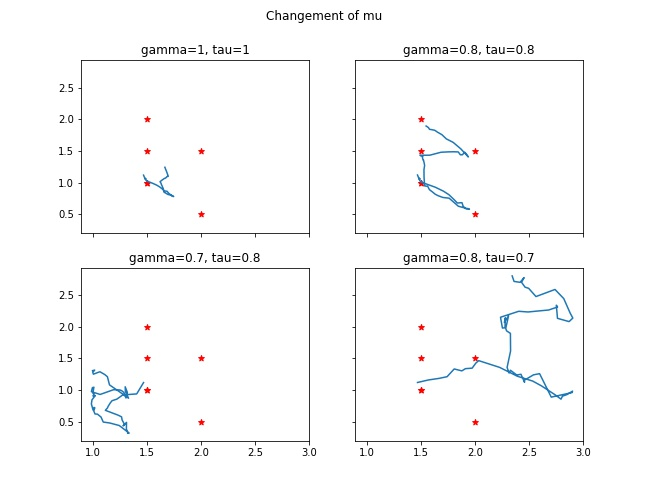
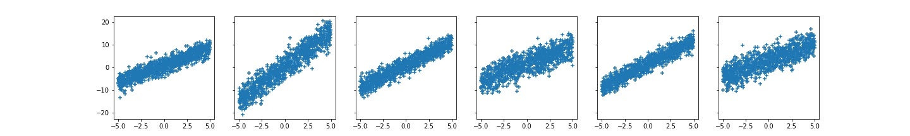
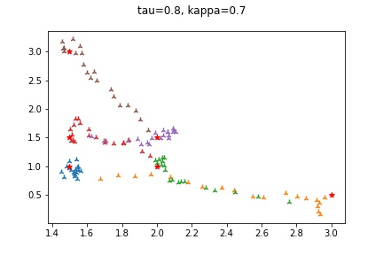
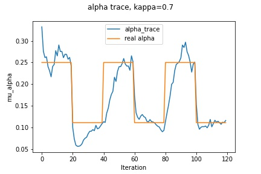

# Bayesian Linear Regression Model : Analysis and Implementation

## Contents:

1. [Theorical Analysis of Bayesian Linear Regression Model](#Theorical-Analysis-of-Bayesian-Linear-Regression-Model)

- [Gaussian Model](#Gaussian-Model)

  - [Calculation of Posterior](#Calculation-of-Posterior)
  - [Sequential Updating](#Sequential-Updating)
  - [Attenuation of Previous Information](#Attenuation-of-Previous-Information)
  - [Distribution of Prediction](#Distribution-of-Prediction)

- [Generalised Gaussian Model](#Generalised-Gaussian-Model)
  - [Approximation with Mean-Field Variational Bayes Method](#Approximation-with-Mean-Field-Variational-Bayes-Method)
  - [Attenuation of Privious Information](#Attenuation-of-Privious-Information-(General))
  - [Distribution of Prediction](#Distribution-of-Prediction-(General))

2. [Implementation and Document](#Implementation-and-Document)

   - [`BayesModel`](#BayesModel)
     - [`snapshot`](#BayesModel.snapshot)
     - [`revert`](#BayesModel.revert)
     - [`mean_trace`](#BayesModel.mean_trace)
     - [`norm_trace`](#BayesModel.norm_trace)
     - [`loss_trace`](#BayesModel.loss_trace)
   - [`RegGauss`](#RegGauss)
     - [`__init__`](#RegGauss.__init__)
     - [`__call__`](#RegGauss.__call__)
     - [`predict`](#RegGauss.predict)
     - [`update`](#RegGauss.update)
     - [`fit`](#RegGauss.fit)
     - [`get_beta`](#RegGauss.get_beta)
   - [`RegGaussGnrl`](#RegGaussGnrl)
     - [`__init__`](#RegGaussGnrl.__init__)
     - [`__call__`](#RegGaussGnrl.__call__)
     - [`predict`](#RegGaussGnrl.predict)
     - [`update`](#RegGaussGnrl.update)
     - [`fit`](#RegGaussGnrl.fit)
     - [`get_alpha`](#RegGaussGnrl.get_alpha)
     - [`get_beta`](#RegGaussGnrl.get_beta)
     - [`a_trace`](#RegGaussGnrl.a_trace)
     - [`b_trace`](#RegGaussGnrl.b_trace)

3. [Appendix](#Appendix)

   - [Convergence of Sequential Updatiing](#Convergence-of-Sequential-Updating)
   - [Attenuation Factor Setting](#Attenuation-Factor-Setting)
  
This document is to cover the theorical analysis of bayesian model, and then give an implementation using `torch` module of Python. Finally, test results on the implemented model will be given, in order to illustrate its performance.

<!-- <div id='Analysis'/>    -->

## Theorical Analysis of Bayesian Linear Regression Model

The logic of Bayes model is to firstly make a hypothesis, generated by our previous knowledge or experience,
then use the newly received information to correct it.
We recall the Bayes rule:
$$p(\alpha | Y) = \frac{p(Y|\alpha)p(\alpha)}{p(Y)} .$$
Where $p(\alpha)$ is the **prior**, denoting the initial *assumption* or *hypothesis* of our situation.
And $p(\alpha | Y)$ is the **posterior**, denoting the corrected knowledge based on the given information.

Now let's get back to our circumstance. 
We consider the target $y \in \mathbb{R}$ and feature $x\in \mathbb{R}^d$ that are linearly correlated. 
i.e., there exists a *coefficient vector* $\beta$ and an *intercept* $c$, s.t. given a sample $(x_i, y_i)$, 
we always have $y_i = x_i^t\beta + c + \epsilon_i$, where $\epsilon_i$ is the *error* satisfying the gaussian distribution: $\epsilon \sim \mathcal{N}(0, \sigma^2)$. Without loss of generality, we can ignore the intercept $c$.
If we consider $y$ as a random variable correlated to $x$, we got:
$$y|x = x^t\beta + \epsilon \sim \mathcal{N}(\beta, \sigma^2) .$$
Our task is to estimate $\beta$, given samples $[x_i, y_i]$ that arrives sequentially. 

There are several ways to estimate $\beta$, for example, the ordinary least squares (OLS) regression, or equivalently the maximum likelihood estimation (MLE). But these methods cannot handle the constantly updating new samples.
That is why we want to use the bayesian model, which is much more flexible.

We defined two bayesian linear regression models, where the first one is purly gaussian, and the second one is more general, with a gamma distributed variance. 
Now we will analyse the two models respectively.


### Gaussian Model

In this model, we consider the coefficents $\beta$ as our parameter to determine, and set the prior as gaussian:
$$\beta_0 \sim \mathcal{N}(m_0, S_0) .$$
Further, we denote $\frac{1}{\sigma^2}$ by $\alpha$, and have the likelihood:
$$Y|X,\beta \sim \mathcal{N}(X\beta, \frac{1}{\alpha}I) .$$
Since the prior and likelihood are both gaussian, we can conclude that the posterior is also gaussian.
We can therefore suppose
$$\beta|X,Y \sim \mathcal{N}(\tilde{m}, \tilde{S}) .$$
We then need to use bayes method to determine $\tilde{m}$ and $\tilde{S}$.

#### Calculation of Posterior

Given a set of samples $X, Y$, where $X$ is is of shape $(n, d)$ and $Y$ of shape $(n, 1)$, we recall the bayes rule:
$$
\begin{align}
p(\beta|X, Y) &= \frac{p(X, Y|\beta) p(\beta)}{p(X, Y)}\\
&= \frac{p(Y|X,\beta)p(\beta)}{p(Y|X)}\\
&\propto p(Y|X,\beta)p(\beta).
\end{align}
$$
Which means, in order to determine the posterior $\beta|X, Y$, we need to compute the product
of $p(Y|X,\beta)$ and $p(\beta)$.

To simplify the computation, we take log at each side:
$$\log p(\beta|X,Y) = \log p(Y|X,\beta) + \log p(\beta) + c \label{eq_post}\tag{1} ,$$
where $c$ is a constant to guarantee that $p(\beta|X,Y)$ is normal. 
We continue the computation, as in [Dtransposed, B][D.Bogunowicz]:
$$
\begin{align}
(\ref{eq_post}) &= -\frac{\alpha}{2}(Y-X\beta)^t(Y-X\beta) -\frac{1}{2}(\beta-m)^tS^{-1}(\beta-m) + c\\
&= -\frac{1}{2}\left( \alpha\beta^tX^tX\beta -2\alpha Y^tX\beta + \alpha Y^tY
                     +\beta^tS^{-1}\beta -2m^tS^{-1}\beta + m^tS^{-1}m \right) + c\\
&= -\frac{1}{2}\left( \beta^t(\alpha X^tX + S^{-1})\beta - 2(\alpha Y^tX + m^tS^{-1})\beta \right) + c\\
&= -\frac{1}{2}(\beta-\tilde{m})^t\tilde{S}^{-1}(\beta-\tilde{m}) + c,
\end{align}
$$
where $\tilde{m}$ and $\tilde{S}$ saitisfy $\tilde{S}^{-1} = S^{-1} + \alpha X^tX$ 
and $\tilde{m}^t\tilde{S}^{-1} = m^tS^{-1}+\alpha Y^tX $, thus
$$
\begin{align}
\tilde{S} &= (S^{-1} + \alpha X^tX)^{-1}, \label{eq_gaus_S}\tag{2} \\
\tilde{m} &= \tilde{S}(S^{-1}m + \alpha X^tY) \label{eq_gaus_m}\tag{3} .
\end{align}
$$

#### Sequential Updating
Having got the formula to calculate posterior, we then start to consider the sequential updating.

Our model specifies an initial prior $\beta_0$, and constantly update the distribution as new sets of samples arrive. 
We can define recursivly: 
$$\beta_{i+1} := \beta_i|X_{i+1}, Y_{i+1} .$$
That means, our model holds a lattest version $\beta$ which is $\beta_i$. When the new samples $(X_{i+1}, Y_{i+1})$ arrive, 
$\beta_i$ is considered as the prior in bayes rule, and the generated posterior $\beta_i | X_{i+1}, Y_{i+1}$ will become the newly updated version replaceing $\beta_i$, it is denoted by $\beta_{i+1}$.

If $\beta_1$ is specified as gaussian, by induction, we can conclude that 
$$\forall i, \beta_i \sim \mathcal{N}(m_i, S_i) ,$$
and based on the section above, we have the iterative equation:
$$
\begin{align}
S_{i+1} &= (S_i^{-1} + \alpha X_{i+1}^tX_{i+1})^{-1}, \label{seq_S} \tag{4} \\
m_{i+1} &= S_{i+1}(S_i^{-1}m_i + \alpha X_{i+1}^tY_{i+1}) \label{seq_m} \tag{5} .
\end{align}
$$

In [appendix](#Convergence-of-Sequential-Updating), we prove the convergency of this iteration.

#### Attenuation of Previous Information
Here we consider a more complex circumstance, where the linear relation between $y$ and $x$ changes by time thus the real coefficient $\check{\beta}$ is not constant.
i.e., at time $i$, we have $y_i = x_i^t\check{\beta}_i + \epsilon $, 
and at time $j$, we have $y_j = x_j^t\check{\beta}_j + \epsilon $, 
while $\check{\beta}_i$ and $\check{\beta}_j$ are not necessarily the same.

The current updating process will not forget the previous information, thus it cannot modify itself to adapt to the new real coefficient. We need to add an **attenuation factor** in order to decrease the influence of previous information and to forget the aged knowledge.

To design a rational way of applying the attenuation factor, we shall understand well the bayesian updatiing equations (\ref{eq_gaus_S}) and (\ref{eq_gaus_m}).

Given the set of samples $X, Y$, if we use OLS or MLE regression, the coefficient that we will get is
$$\hat{\beta} = (X^tX)^{-1}X^tY. $$
Denote $(X^tX)^{-1}X$ by $A$. Since $\{y_j \}$ are i.i.d., $\text{Cov}(Y) = \frac{1}{\alpha}I $.
Thus we have 
$$\hat{S} = \text{Cov}(\hat{\beta}) = A\text{Cov}(Y)A^t = \frac{1}{\alpha}(X^tX)^{-1} .$$
And equivalently $\hat{S}^{-1} = \alpha X^tX $.
Further, $\hat{S}\alpha X^tY = (X^tX)^{-1}X^tY = \hat{m}$.
Note that in the bayesian model, if we set $m = 0$ and $S^{-1} = 0$, using iteration equations (\ref{eq_gaus_S}) and (\ref{eq_gaus_m}), we have $\hat{S} = \tilde{S}$ and $\hat{m} = \tilde{m}$.

This means that bayesian updating is actually merging the previous knowledge (prior) with the MLE result of new sample set.
If we want to reduce the influence of previous knowledge, we can make $m$ and $S^{-1}$ closer to 0, the iterative equations thus become:
$$
\begin{align}
S_{i+1} &= (\gamma S_i^{-1} + \alpha X_{i+1}^tX_{i+1})^{-1},  \\
m_{i+1} &= S_{i+1}(S_i^{-1}(\tau m_i) + \alpha X_{i+1}^tY_{i+1}) .
\end{align}
$$
Where $\gamma,\tau \in [0,1] $. If the attenuation factor is $0$, the model is equivalent to the MLE regression to each new data sample, and keeps none of the previous information. If the factor is $1$, this model keeps all previous information.
We prove in [appendix](#Attenuation-Factor-Setting) that we must set $\gamma = \tau$ . The influence of attenuation factor are show in the figure below:
  
*(fig: Trace of mu_beta)*

We plot the traces of $\{\beta_i\}_{i=0}^{2000}$ with different $\gamma$ and $\tau$, where the red stars are $\check{\beta}$ at different time.
We note that 
- when $\tau = \gamma = 1$ (without forgetting), the sequence $\beta_i$ tends to approche real $\check{\beta} $, while the velocity is so small that it cannot converge to the real values.
- when $\tau$ and $\gamma$ are not equivalent,  the sequence $\beta_i$ will not converge, or will converge to 0.
- when $\tau = \gamma$ and $\tau < 1$, $\beta_i$ can approche rappidly $\check{\beta}$.

Setting $\tau = \gamma$, our iterative equations with attenuation factor are:
$$
\begin{align}
S_{i+1} &= (\tau S_i^{-1} + \alpha X_{i+1}^tX_{i+1})^{-1}, \label{seq_S_tau} \tag{6} \\
m_{i+1} &= S_{i+1}(S_i^{-1}(\tau m_i) + \alpha X_{i+1}^tY_{i+1}) \label{seq_m_tau} \tag{7} .
\end{align}
$$

#### Distribution of Prediction
The final object of this model is to predict the target $y$. Here we compute the distribution of this prediction.

Using the marginal rule,
$$p(Y|X) = \int p(Y|X, \beta)p(\beta) d\beta . $$

Since $Y|X,\beta \sim \mathcal{N}(X\beta, 1/\alpha)$, expand the formula above, we get:
$$
\begin{align}
p(Y|X) &\propto \int_{\Omega}\exp\left( -\frac{\alpha}{2}(Y-\beta X)^2 - \frac{1}{2}(\beta-m)^tS^{-1}(\beta-m) \right) d\beta \\
&\propto \int_{\Omega}\exp\left( -\frac{1}{2}( \alpha Y^tY - 2\alpha YX^t\beta + \alpha\beta^t XX^t\beta 
                                 + m^tS^{-1}m - 2m^tS^{-1}\beta + \beta^tS^{-1}\beta ) \right) d\beta\\
&\propto \exp(-\frac{\alpha}{2}Y^tY - \frac{1}{2}m^tS^{-1}m) 
         \cdot  \int_{\Omega}\exp (\underbrace{ -\frac{1}{2}(\beta^t(\alpha XX^t+S^{-1})\beta - 2(\alpha YX^t+m^tS^{-1})\beta ) }_{(i)}) d\beta.
\end{align}
$$

Now we calculate the term (i). We introduce temporary symbols $\breve{S}, \breve{m}$ and $u$, s.t.:
$$
\begin{align}
(i) &= -\frac{1}{2}(\beta \breve{S}^{-1}\beta - 2u^t\beta)\\
&= -\frac{1}{2}(\beta-\breve{m})^t \breve{S}^{-1}(\beta-\breve{m}) + \frac{1}{2}\breve{m}^t\breve{S}^{-1}\breve{m}
\end{align}
$$

Then the temporary symbols satisfy:
$\breve{S}^{-1} = S^{-1} + \alpha XX^t $, $u = S^{-1}m + \alpha X^tY \alpha X^tY $, 
and $\breve{m}^t \breve{S}^{-1} = u^t $. Thus $\breve{m} = \breve{S}u = \breve{S}(S^{-1}m + \alpha X^tY) $.
Substitute the values of in to formula(i), then we got:
$$\int \exp \left( (i) \right) d\beta \propto \exp\left( \frac{1}{2}\breve{m}^t\breve{S}^{-1}\breve{m} \right).  $$

Therefore:
$$
\begin{align}
p(Y|X) &\propto \exp \left( -\frac{1}{2}( \alpha Y^tY + m^tS^{-1}m - \breve{m}^t\breve{S}^{-1}\breve{m} ) \right)\\
&\propto \exp\left( -\frac{1}{2}\left( Y^t(\alpha-\alpha^2X^t\breve{S}X)Y - 2\alpha X^t\breve{S}S^{-1}mY \right) \right)\\
&\propto \exp( -\frac{1}{2} (Y-\mu_{Y|X})^t \Sigma_{Y|X}^{-1} (Y-\mu_{Y|X}) ).
\end{align}
$$

We conclude that the distribution of $Y|X$ is 
$$Y|X \sim \mathcal{N}(\mu_{Y|X}, \Sigma_{Y|X}). $$
Where 
$$
\begin{align}
\Sigma_{Y|X}^{-1} &= \alpha I - \alpha^2 X\breve{S}X^t,\\
\mu_{Y|X} &= \alpha \Sigma_{Y|X}X\breve{S}S^{-1}m.
\end{align}
$$


<!-- <div id='General'/>    -->

### Generalised Gaussian Model
In the previous model, the precision value $\alpha$ is specified as a constant. In practice, the variance of $Y|X$ is always close to $\alpha I$. If $\alpha$ is not specified properly at the beginning, the predicted distribution of $Y|X$ will not be accurate. 
Therefore in this section, we propose a generalised bayesian model, of which the precision is also a parameter to determine.

Consider the model where likelihood is 
$$ y|x, \alpha, \beta \sim \mathcal{N}(\hat{y}=x^t\beta, \alpha^{-1}). $$
The precision $\alpha$ and coefficient $\beta$ are random parameters, who satisfy respectively Gamma and Gaussian distributions:
$$
\begin{align}
\alpha &\sim \Gamma(a, b),\\
\beta &\sim \mathcal{N}(m, S).
\end{align}
$$
In this model, we have four hyperparameters $a, b, m$ and $S$ to be determined by Bayesian method.

Considering that we have $N$ independent samples, denoted by $X = [x_1, \dots, x_N]^t$ of shape $(N, d)$ and $Y = [y_1, \dots, y_N]^t$ of shape $(N, 1) $. 
Applying Bayes rule, 
$$
\begin{align}
p(\alpha, \beta | X,Y) &\propto p(X, Y|\alpha, \beta)p(\alpha, \beta)\\
&\propto p(Y|X, \alpha, \beta) p(\alpha, \beta).
\end{align}
$$
Convert the formula above to log form, 
$$\log p(\alpha, \beta | X, Y) = \log p(Y|X, \alpha, \beta) + \log p(\alpha, \beta) + c. $$
Since $a, b$ are independent to $m, S$, the params $\alpha$ and $\beta$ are independent.
Expand the formula,
$$
\begin{align}
\log p(\alpha, \beta |X, Y) &= \log p(Y|X, \alpha, \beta)  + \log p(\alpha) + \log p(\beta) + c\\
&= -\frac{\alpha}{2}(Y-X\beta)^t(Y-X\beta) + \frac{N}{2} \log \alpha 
   - (\beta-m)^tS^{-1}(\beta-m) + (a-1)\log \alpha - b\alpha + c
\end{align}
$$

Note that in the formula above cannot be factorised as 
$\log p(\alpha, \beta |X, Y) = \log f_\alpha(\alpha) + \log f_\beta(\beta) $. Which means that we cannot get an explicit analytical solution of posterior.
We thus need to apply the **Mean-Field Variational Bayes**(MFVB) method as proposed in [Brain K.][B.Keng] to compute an approximation.

#### Approximation with Mean-Field Variational Bayes Method
Introduction and technical details of MFVB method can be found in the article [Variational Bayes and the Mean-Filed Approximation](http://bjlkeng.github.io/posts/variational-bayes-and-the-mean-field-approximation/). 

The MFVB method assumes that $Q = \left\{ q: q(\alpha, \beta) = q_{\alpha}(\alpha)q_{\beta}(\beta) \right\}$.
Recall the optimasition equation of MFVB in log form:
$$\log q_j^*(\theta_j) = \mathbf{E}_{q_{-j}} [\log p(\theta_j, \theta_{-j}, x)] + c.$$

We firstly consider $q_\alpha$:
$$
\begin{align}
\log q_{\alpha}(\alpha) &= \mathbf{E}_{\beta} [\log p(Y,\alpha,\beta|X)] + c\\
&= \mathbf{E}_{\beta} [\log p(Y|X, \alpha,\beta) + \log p(\alpha) + \log p(\beta)] + c\\
&= \mathbf{E}_{\beta} [\log p(Y|X, \alpha,\beta) + \log p(\alpha)] + c\\
&= \mathbf{E}_{\beta} [\frac{N}{2}\log \alpha - \frac{\alpha}{2}(Y-X\beta)^t(Y-X\beta)
                       + (a-1)\log \alpha - b\alpha ] + c\\
&= \frac{N}{2} \log \alpha - \frac{\alpha}{2}\mathbf{E}_{\beta}[(Y-X\beta)^t(Y-X\beta)] + (a-1)\log \alpha -b \alpha + c\\
&= (\frac{N}{2} + a - 1) \log \alpha - (b+\frac{C}{2}) \alpha + c,
\end{align}
$$
where 
$$C = \mathbf{E}_{\beta} [(Y-X\beta)^t(Y-X\beta)] = (Y-Xm)^t(Y-Xm) + \text{Tr}(XSX^t).$$
We can recognise that the formula above is the log density of Gamma distribution, thus we get
$$\tilde{\alpha} \sim \Gamma(\tilde{a}, \tilde{b}), $$
where 
$$
\begin{align}
\tilde{a} &= \frac{N}{2} + a \label{eq_g_a}\tag{8} ,\\
\tilde{b} &= b + \frac{C}{2} \label{eq_g_b}\tag{9} .
\end{align}
$$

Then we consider $q_\beta$:
$$
\begin{align}
\log q_{\beta}(\alpha) &= \mathbf{E}_{\alpha}[\log p(Y, \alpha, \beta |X)] + c\\
&= \mathbf{E}_{\alpha}[\log p(Y|X, \alpha, \beta) + \log p(\beta) + \log p (\alpha)] + c\\
&= \mathbf{E}_{\alpha}[\log p(Y|X, \alpha, \beta) + \log p(\beta)] + c\\
&= \mathbf{E}_{\alpha}[-\frac{\alpha}{2}(Y-X\beta)^(Y-X\beta) - \frac{1}{2}(\beta-m)^tS^{-1}(\beta-m)] + c\\
&= -\frac{\mu_\alpha}{2}(\beta^tX^tX\beta - 2Y^tX\beta) - \frac{1}{2}(\beta^tS^{-1}\beta - 2m^tS^{-1}\beta) + c\\
&= -\frac{1}{2}( \beta^t(S^{-1}+\mu_\alpha X^tX)\beta - 2(\mu_\alpha Y^tX + m^tS^{-1})\beta ) + c.
\end{align}
$$
The formula above is the log density of Guassian  distribution, 
$$\tilde{\beta} \sim \mathcal{N}(\tilde{m}, \tilde{S}), $$
where
$$
\begin{align}
\tilde{S}^{-1} &= S^{-1} + \mu_\alpha X^tX \label{eq_g_S}\tag{10} ,\\
\tilde{m} &= \tilde{S}(\mu_\alpha X^tY + S^{-1}m) \label{eq_g_m}\tag{11} .
\end{align}
$$

Consider the sequential case, given $a_{i}, b_{i}, m_{i}, S_{i}$ and new samples $x_{i+1}, Y_{i+1}$,
the process of computing $a_{i+1}, b_{i+1}, m_{i+1}$ and $S_{i+1}$ is:
1. Comput $a_{i+1}$ by equation (\ref{eq_g_a}), which is determined.
2. Use $b_i$ as $b$, to calculate $\tilde{S}$ and $\tilde{m}$, using equation (\ref{eq_g_S}) and equation \ref{eq_g_m}.
3. Use the newly computed $\tilde{S}$ and $\tilde{m}$ to compute $\tilde{b}$ by equation (\ref{eq_g_b}).
4. Use $\tilde{b}$ to calculate $\tilde{S}$ and $\tilde{m}$, using equation (\ref{eq_g_S}) and equation \ref{eq_g_m}.
5. Repeat step 3 and 4 till convergence.

<!-- We are faced with the convergence problem of this iteration, of which a breif proof is given in the appendix. -->
The convergence of MFVB method is given in [(B. Wang and D.M. Titterinton, 2006)][B.Wang].


#### Attenuation of Privious Information (General)
As in the previous model, we define also the *attenuation* factor in the generalised model. 
This model has 4 hyperparameters, we can therefore use 4 factors $\lambda_{a}, \lambda_{b}, \lambda_{m}$ and $\lambda_{S^{-1}}$. 
Using a similar process, we deduce that $\lambda_{a} = \lambda_{b}$ and $\lambda_{m} = \lambda_{S^{-1}}$ guarantee the convergence of iteration and updating. We denote $\lambda_{a,b}$ by $\kappa$, and $\lambda_{m, S^{-1}}$ by $\tau$, 
The updating equations becomes:
$$
\begin{align}
\tilde{a} &= \kappa a + \frac{N}{2} \label{eq_g_ak}\tag{12} ,\\
\tilde{b} &= \kappa b + \frac{C}{2} \label{eq_g_bk}\tag{13} ,\\
\tilde{S}^{-1} &= \tau S^{-1} + \mu_\alpha X^tX \label{eq_g_Sk}\tag{14} ,\\
\tilde{m} &= \tilde{S}(\mu_\alpha X^tY + S^{-1}(\tau m)) \label{eq_g_mk}\tag{15} .
\end{align}
$$

Using the following data points, where both the coefficient and the variance are changing, 
we test the attenuation scheme, and results are given below.
  
*fig: Sample data points*  


  
*fig: Test results*


#### Distribution of Prediction (General)
We consider the distribution of $Y|X$ in this generalised model,
$$p(Y|X) = \int \int p(Y|X,\alpha,\beta) p(\beta) p(\alpha) d\beta d\alpha. $$ 
With 
$$Y|X, \alpha, \beta \sim \mathcal{N}(X\beta, 1/\alpha) ,$$
$$\alpha \sim \Gamma(a, b) ,$$
and
$$\beta \sim \mathcal{N}(m, S). $$

We are definitly not favorable to compute this double integration directly, thus we consider two approaches to get an accurate or approximated result.

##### Approach 1:
In approach 1, we eliminate $\alpha$ from the integration firstly. 

Consider the random variable $\mathfrak{Y} := Y|X,\beta $, we have 
$$\mathfrak{Y}|\alpha \sim \mathcal{N}(\mu_{\mathfrak{Y}}, \frac{1}{\alpha}) ,$$
and 
$$\alpha \sim \Gamma(a,b).$$
Where $\mu_{\mathfrak{Y}} = X\beta$ is independent to $\alpha$.
We recognise that the random vector $(\mathfrak{Y}, \alpha)$ satisfies [**Normal-Gamma** distirbution](https://en.wikipedia.org/wiki/Gamma_distribution):
$$(\mathfrak{Y}, \alpha) \sim \text{NG}(\mu_{\mathfrak{Y}}, 1, a, b) .$$

Using the property of Noraml-Gamma distribution, we get the marginal distribution of $\mathfrak{Y} $, 
and equivalently the distribution of $Y|X,\beta $:
$$Y|X,\beta = \mathfrak{Y} \sim 
\mathcal{T}(\nu=2a, \mu=\mu_{\mathfrak{Y}}, \sigma^2=\frac{b}{a}) \label{fm_g_YXb}\tag{16} , $$
Where $\mathcal{T}$ indicates the [**Student-t** distribution](https://en.wikipedia.org/wiki/Student%27s_t-distribution).
Formula (\ref{fm_g_YXb}) can also be represented as 
$$\sqrt{\frac{a}{b}} (Y - \mu_{Y|X,\beta})|X,\beta 
= \sqrt{\frac{a}{b}} (\mathfrak{Y}-\mu_{\mathfrak{Y}}) \sim \mathcal{T}(\nu=2a) .$$

Denote $\sqrt{\frac{a}{b}} (Y - \mu_{Y|X,\beta})|X,\beta$ by $T$, $T \sim \mathcal{T}(\nu=2a) $,
and 
$$Y|X = \sqrt{\frac{b}{a}}T + \mu_{Y|X, \beta}.$$
Note that$ \mu_{Y|X, \beta} = X\beta \sim \mathcal{N}(Xm, XSX^t) $. 
Therefore $Y|X$ is represented as the summation of two random variables satisfying repectively t-distribution and gaussian distribution.

Suppose the probability density function (pdf) of $\sqrt{\frac{b}{a}}T$ and $\mu_{Y|X,\beta}$ are respectively $f_T$ and $f_\mu$, then the pdf of $Y|X$ is 
$$f_{Y|X} = f_T \star f_\mu .$$
Where the notation $\star$ indicates the *convolution* over $\mathbb{R}$.
However, we are not able to calculate the explicit expression of this convolution, in order to guarantee the calculability, we need to take an approximation.

We notice that $T_\nu \rightharpoonup \mathcal{N}(0, 1)$ as $\nu \to \infty $, where $\rightharpoonup$ denotes the *week-covergence*. 
Hence, when $\nu = 2a$ is sufficiently large, we can use a normal distributed random variable $N$ to approximate that of $T$.
Then we have 
$$Y|X \simeq \sqrt{\frac{b}{a}}N + \mu_{Y|X,\beta} \sim \mathcal{N}(Xm, \frac{b}{a}I+XSX^t) .$$

##### Approach 2:
In approach 2, we eliminate $\beta$ from the integration firstly.

Based on the calculation in the previous model, we can get
$$Y|X, \alpha \sim \mathcal{N}(\mu_{Y|X,\alpha}, \Sigma_{Y|X,\alpha}), $$
where 
$$
\begin{align}
\mu_{Y|X,\alpha} &= \alpha\Sigma_{Y|X,\alpha}X\breve{S}_{\alpha}S^{-1}m \label{fm_muYXa}\tag{17},\\ 
\Sigma_{Y|X,\alpha}^{-1} &= \alpha I - \alpha^2 X\breve{S}_{\alpha}X^t \label{fm_SYXa}\tag{18}. 
\end{align}
$$, 
with $\breve{S}_{\alpha}$ defined as
$$\breve{S}_\alpha := (S^{-1} + \alpha X^tX)^{-1} \label{fm_bSa}\tag{19} $$.

Then 
$$
p(Y|X) = \mathbf{E}_{\alpha}\left[ \exp(-\frac{\alpha}{2}(Y-\mu_{Y|X,\alpha})^t \Sigma_{Y|X,\alpha}^{-1}(Y-\mu_{Y|X,\alpha})) \right].
$$
We cannot get an explicit expression of this integration, thus again, we have to take an approximation.

We suppose that $Y|X$ satisfies the gaussian distribution,
$$Y|X \sim \mathcal{\mu_{Y|X}, \Sigma_{Y|X}}. $$
We use a simple method to approximate $\mu_{Y|X}$ and $\Sigma_{Y|X}$:
1. Use the expected value of $\breve{S}_{\alpha}$ to approximate $\breve{S} $: 
$$\breve{S}^{-1} \simeq \mathbf{E}_{\alpha}[\breve{S}^{-1}|\alpha] = S^{-1} + \mu_{\alpha}X^tX.$$
2. Use the $\breve{S}$ defined in step 1 to replace $\breve{S}_{\alpha}$ in formula (\ref{fm_SYXa}), and then use the expected value of $\Sigma_{Y|X,\alpha}^{-1}$ to approximate $\Sigma_{Y|X}^{-1} $:
$$ \Sigma_{Y|X}^{-1} \simeq \mathcal{E}_{\alpha}[\alpha I - \alpha^2 X\breve{S}X^t] 
= \mu_\alpha I - \mu_{\alpha^2}X\breve{S}X^t .$$
3. Use $\breve{S}$ and $\Sigma_{Y|X}$ defined in step 1 and 2 to replace $\breve{S}_\alpha$ $\Sigma_{Y|X,\alpha}$ in formula (\ref{fm_muYXa}), and calculate its expected value to approximate $\mu_{Y|X} $:
$$\mu_{Y|X} \simeq \mathbf{E}_{\alpha}[\alpha\Sigma_{Y|X}X\breve{S}S^{-1}m] = \mu_\alpha \Sigma_{Y|X}X\breve{S}S^{-1}m.$$

Since $\alpha \sim \Gamma(a,b)$, we have $\mu_\alpha = \frac{a}{b} $, 
and $\mu_{\alpha^2} = \frac{a^2+a}{b^2} $.
Therefore:
$$
\begin{align}
\mu_{Y|X} &\simeq \frac{a}{b}\Sigma_{Y|X} X \breve{S}S^{-1}m \label{fm_muYX}\tag{20} ,\\
\Sigma_{Y|X}^{-1} &\simeq \frac{a}{b}I - \frac{a^2+a}{b^2}X\breve{S}X^t \label{fm_SYX}\tag{21} ,
\end{align}
$$
where
$$ \breve{S}^{-1} \simeq S^{-1} + \frac{a}{b}X^tX .$$


## Implementation and Document
The Bayes module has the following structure:
```
.bayes
  |
  ----__init__.py
  |
  ----bayes.py
  |    |
  |    ----BayesModel
  ----reg_gauss.py
  |    |
  |    ----RegGauss
  ----reg_gauss_gnrl.py
  |    |
  |    ----RegGaussGnrl
  ----visualise.py
```
In the file `bayes.py`, we defined an *abstract class* `BayesModel`, which inherits the class `torch.nn.Module`, and gives a basic frame for all bayesian models. 
In `reg_gauss.py`, we defined the class `RegGauss`, inheritting `bayes.BayesModel`, which implements our gaussian bayesian linear regression model.
In `reg_gauss_gnrl.py`, we defined the class `RegGaussGnrl`, inheritting `bayes.BayesModel`, which implements our generalised bayesian linear regression model.
In `visualise.py`, we defined a function `visualise`, used to plot the pdf of a random variable or a 2-dim random vector.

Here we give the document of this project.
<!-- <div id='RegGauss'/>   -->


### `BayesModel`
Functions in this part are common for the two classes `RegGauss` and `RegGaussGnrl`.
#### `BayesModel.snapshot`
```python
BayesModel.snapshot(self)
```
Function used to save the current model hyperparameters.  
This function is executed automatically at the beginning of `fit` function.

#### `BayesModel.revert`
```python
BayesModel.revert(self)
```
Function used to revert the hyperparameters' values to the values saved by `snapshot` function.


#### `BayesModel.mean_trace`
```python
BayesModel.mean_trace(self)
```
Function used to return the stored $m_i$ values. 
- **Return**:
  - **arr_trace : np.ndarray, of shape (n_iteration, self.dim)**  
  The array $[m_i]$.
#### `BayesModel.norm_trace`
```python
BayesModel.norm_trace(self)
```
Function used to return the stored $\|S_i\|_2$ values. 
- **Return**:
  - **arr_trace : np.ndarray, of shape (n_iteration, 1)**  
  The array $[\|S_i\|_2]$.
#### `BayesModel.loss_trace`
```python
BayesModel.loss_trace(self)
```
Function used to return the stored loss values. 
- **Return**:
  - **arr_trace : np.ndarray, of shape (n_iteration, 1)**  
  The array of loss values.


### `RegGauss`
#### `RegGauss.__init__`
```python
RegGauss.__init__(self, dim, tau=1, **kwargs)
```
- **Parameters**:
  - **dim : int**  
  The dimension of x.
  - **tau (Optional) : float64, in interval $[0, 1]$, defualt is 1**  
  The attenuation factor for $m$ and $S^{-1}$. If tau=0, all previous information will be dropped. If tau=1, all previous information will be preserved.
  - **mu (Optional) : np.ndarray/torch.tensor, of shape (dim$[+1]$, $[1]$), defualt is 0**  
  The intitial mean vector of beta, i.e. m_0. If length of mu is dim+1, the last element is the intercept.
  - **sig (Optional) : np.ndarray/torch.tensor, of shape (dim, dim), (dim+1, dim+1) or (dim$[+1]$, $[1]$), or float64**  
  The initial covariance matrix of beta, i.e. S_0. If a matrix is given, this matrix is required to be symmetric positive definet.  
  If this param is not given, the initial covariance matrix is set as the identity matrix.  
  If shape is (dim, dim), the intercept term is considered to have initial variance 1, and to be independent with other coefficients.  
  If shape is (dim+1, dim+1), the sig is used as initial convariace matrix.  
  If shape is (dim$[+1]$, ) the covariance matrix is considered to be diagonal, with sig as its diagonal.
  - **sigma (Optional) : float64**  
  The standard deviation of error, i.e. $\sigma$ in the model. We set alpha = 1/(sigma^2) If this param is not given, alpha=1 is used.
  - **alpha (Optional) : float64**  
  The precision of error, i.e. $\alpha$ in the model. Note that this param has a higher priority than sigma. If alpha is specified, sigma will be ignored.  
  - **trace_loss (Optional) : bool**  
  - **trace_norm (Optional) : bool**
  - **trace_mean (Optional) : bool**
  Whether store the trace of loss/$\|S\|$/$m$ values at each update.  
  
#### `RegGauss.__call__` 
```python
RegGauss.__call__(self, X)
```
since our model inherits nn.Module, this function invokes the `forward` function.
- **Parameters**:
  - **X : np.ndarray/torch.tensor, of shape (n, dim) or (dim, )**  
- **Return**:
  - **Y : torch.tensor, of shape (n, 1) or (1, )**  
  The predicted Y *value(s)* using liner model.
 
#### `RegGauss.predict`
```python
RegGauss.predict(self, X, **kwargs)
```
This function is used to generate the predicted *random vector* $Y|X$.
- **Parameters**:
  - **X : np.ndarray/torch.tensor, of shape (n, dim) or (dim, )**  
  - **indiv : bool**  
  Whether give the prediction separately. If indiv is True, the return will be a list of random variables.
- **Return**:
  - **Y|X : scipy random variable or random vector or a list of random variables**  
   
#### `RegGauss.update`  
```python
RegGauss.update(self, Xi, Yi, **kwargs)
```
Function used to execute one step update. Remark: users of this module are not suggested to use this function, the function `fit` is more secure.
- **Parameters**:  
  - **Xi : np.ndarray/torch.tensor, of shape (n, dim)**  
  - **Yi : np.ndarray/torch.tensor, of shape (n, 1)**  
  
#### `RegGauss.fit`
```python
RegGauss.fit(self, X, Y, chunck_size=None, verbose=False, **kwargs)
```
Function used to train this model, using the given samples $(X, Y)$.  
Remark: this function does NOT re-initialise the model.
- **Parameters**:
  - **X : np.ndarray/torch.tensor, of shape (n, dim)**  
  - **Y : np.ndarray/torch.tensor, of shape (n, $[1]$)**  
  - **chunck_size (Optional) : int, default is None**  
  The size of each data chucnk to be used in function `update`.  
  If this param is None, chunck_size = n is applied.
  - **plot (Optional) : bool**
  Whether plot the change of loss and/or change of norm.  
  If `trace_loss` is False, this params will be ignored.
  - **tau (Optional) : float64, in interval $[0, 1]$**  
  This param is used to replace `self.tau_` in this fitting process *TEMPORARILY*.
  

#### `RegGauss.get_beta`
```python
RegGauss.get_beta(self)
```
Function used to get the random vector $\beta$.
- **Return**:
  - **beta : scipy random vector**  
  The multi-variate normal random vector $\beta$.
  


### `RegGaussGnrl`
#### `RegGaussGnrl.__init__`
```python
RegGaussGnrl.__init__(self, dim, tau=1, kappa=1, tol=0.01, **kwargs)
```
- **Parameters**:
  - **dim : int**  
  The dimension of x.
  - **tau (Optional) : float64, in interval $[0, 1]$, defualt is 1**  
  The attenuation factor for $m$ and $S^{-1}$. If tau=0, all previous information will be dropped. If tau=1, all previous information will be preserved.
  - **kappa (Optional) : float64, in interval $[0, 1]$ default is 1**  
  The attenuation factor for $a$ and $b$. If kappa=0, all previous information will be dropped. If kappa=1, all previous information will be preserved.
  - **tol (Optional) : float64, positive**  
  The tolerance of MFVB iteration process.
  - **mu (Optional) : np.ndarray/torch.tensor, of shape (dim$[+1]$, $[1]$), defualt is 0**  
  The intitial mean vector of beta, i.e. m_0. If length of mu is dim+1, the last element is the intercept.
  - **sig (Optional) : np.ndarray/torch.tensor, of shape (dim, dim), (dim+1, dim+1) or (dim$[+1]$, $[1]$), or float64**  
  The initial covariance matrix of beta, i.e. S_0. If a matrix is given, this matrix is required to be symmetric positive definet.  
  If this param is not given, the initial covariance matrix is set as the identity matrix.  
  If shape is (dim, dim), the intercept term is considered to have initial variance 1, and to be independent with other coefficients.  
  If shape is (dim+1, dim+1), the sig is used as initial convariace matrix.  
  If shape is (dim$[+1]$, ) the covariance matrix is considered to be diagonal, with sig as its diagonal.
  - **a (Optional) : float64, Default is 2**  
  The initial hyperparam $a$ in $\Gamma(a, b)$ describing the distribution of $\alpha$.
  - **b (Optional) : float64, Default is 0.5**  
  The initial hyperparam $b$ in $\Gamma(a, b)$ describing the distribution of $\alpha$.
  - **trace_loss (Optional) : bool**  
  - **trace_norm (Optional) : bool**
  - **trace_mean (Optional) : bool**
  - **trace_a (Optional) : bool**
  - **trace_b (Optional) : bool**
  Whether store the trace of loss/$\|S\|$/$m$/$a$/$b$ values at each update.  

#### `RegGaussGnrl.__call__` 
```python
RegGaussGnrl.__call__(self, X)
```
since our model inherits nn.Module, this function invokes the `forward` function.
- **Parameters**:
  - **X : np.ndarray/torch.tensor, of shape (n, dim) or (dim, )**  
- **Return**:
  - **Y : torch.tensor, of shape (n, 1) or (1, )**  
  The predicted Y *value(s)* using liner model.

#### `RegGauss.predict`
```python
RegGauss.predict(self, X, **kwargs)
```
This function is used to generate the predicted *random vector* $Y|X$.
- **Parameters**:
  - **X : np.ndarray/torch.tensor, of shape (n, dim) or (dim, )**  
  - **method : 1 or 2**  
  Indicating the approach with which we calculate the random vector. Check [Here](#Distribution-of-Prediction-(General)) for more information.
  - **indiv : bool**  
  Whether give the prediction separately. If indiv is True, the return will be a list of random variables.
- **Return**:
  - **Y|X : scipy random variable or random vector or a list of random variables**  
  
#### `RegGaussGnrl.update`  
```python
RegGaussGnrl.update(self, Xi, Yi, **kwargs)
```
Function used to execute one step update. Remark: users of this module are not suggested to use this function, the function `fit` is more secure.
- **Parameters**:  
  - **Xi : np.ndarray/torch.tensor, of shape (n, dim)**  
  - **Yi : np.ndarray/torch.tensor, of shape (n, 1)**  
  
  
#### `RegGaussGnrl.fit`
```python
RegGaussGnrl.fit(self, X, Y, chunck_size=None, verbose=False, **kwargs)
```
Function used to train this model, using the given samples $(X, Y)$.  
Remark: this function does NOT re-initialise the model.
- **Parameters**:
  - **X : np.ndarray/torch.tensor, of shape (n, dim)**  
  - **Y : np.ndarray/torch.tensor, of shape (n, $[1]$)**  
  - **chunck_size (Optional) : int, default is None**  
  The size of each data chucnk to be used in function `update`.  
  If this param is None, chunck_size = n is applied.
  - **plot (Optional) : bool**
  Whether plot the change of loss and/or change of norm.  
  If `trace_loss` is False, this params will be ignored.
  - **tau (Optional) : float64, in interval $[0, 1]$**  
  This param is used to replace `self.tau_` in this fitting process *TEMPORARILY*.
  - **kappa (Optional) : float64, in interval $[0, 1]$**  
  This param is used to replace `self.kappa_` in this fitting process *TEMPORARILY*.
  
#### `RegGaussGnrl.get_alpha`
```python
RegGaussGnrl.get_alpha(self)
```
Function used to get the random variable $\alpha$.
- **Return**:
  - **alpha : scipy random vector**  
  The Gamma random variable $\alpha$.
  
#### `RegGaussGnrl.get_beta`
```python
RegGaussGnrl.get_beta(self)
```
Function used to get the random vector $\beta$.
- **Return**:
  - **beta : scipy random vector**  
  The multi-variate normal random vector $\beta$.
  
#### `RegGaussGnrl.a_trace`
```python
RegGaussGnrl.a_trace(self)
```
Function used to return the stored $a_i$ values. 
- **Return**:
  - **arr_trace : np.ndarray, of shape (n_iteration, 1)**  
  The array $[a_i]$.
#### `RegGaussGnrl.b_trace`
```python
RegGaussGnrl.b_trace(self)
```
Function used to return the stored $b_i$ values. 
- **Return**:
  - **arr_trace : np.ndarray, of shape (n_iteration, 1)**  
  The array $[b_i]$.


## Appendix
### Convergence of Sequential Updating
We consider the real coefficient $\beta$ as a random vector $\beta_\infty$ whose pdf is $\delta_\beta$.
Using the iteration defined [here](#Sequential-Updating), we generate the sequence of random vectors 
$[\beta_i \ sim \mathcal{N}(m_i, S_i) ]$.

For a sample set $X$ and a specific positive number $\xi$, we say that $X$ is $\xi$-*informative* iff $\|X^tX\| > \xi$.
Here we make an assumption : given $\xi > 0$, there are infinitly many $Xi$ which is $\xi$-informative.

Since 
$S_{i+1}^{-1} = S_{i}^{-1} + \alpha X_{i+1}^{t}X_{i+1} $, and $\|S_{i}^{-1}\| > 0 $,  we get 
$$\|S_{i+1}^{-1} \| \ge \|S_{i}^{-1}\| + \xi ,$$ 
thus $$\lim_{i\to \infty} \|S_{i}^{-1}\| = +\infty ,$$ 
which implies $$\lim_{i \to \infty} \|S_{i}\| = 0. $$
And thus $$\lim_{i\to \infty} S_i = 0. $$

Additionally, 
$$
\begin{align}
S_{i+1}^{-1}m_{i+1} = S_{i}^{-1}m_{i} + \alpha X_{i+1}^tY_{i+1} 
&\implies S_{k}^{-1}m_k = S_0^{-1}m_0 + \alpha \sum_{i=1}^{k}X_i^tY_i. \\
&\implies m_{k} = S_k\sum_{i=1}^{k}X_i^tY_i + S_{k}S_0^{-1}m_0
\end{align}
$$
Since $S_k \to 0 $, we have $S_{k}S_0^{-1}m_0 \to 0 $. 

Further, $X_i^tY_i = X_i^t(X_i\beta + E_i) = X_i^tX_i\beta + X_i^tE_i $,
and $S_k = \left( S_0^{-1} + \alpha \sum_{i=1}^{k}X_i^tX_i \right)^{-1} $,
we get 
$$\lim_{k\to \infty} \alpha S_k \left(\sum_{i=1}^{k}X_i^tY_i \right) = \beta .$$

Finally, we get that $\beta_i \rightharpoonup \beta_\infty $, where $\rightharpoonup$ denotes the week convergence (or convergence by law).


### Attenuation Factor Setting
In this section we prove that using algorithm in [Attenuation of Previous Information](#Attenuation-of-Previous-Information), to guarantee the convergence, we must set $\gamma = \tau$.

Consider the induction equations
$$
\begin{align}
S_{i+1}^{-1} &= \tau S_{i}^{-1} + \alpha X_i^tX_i,\\ 
S_{i+1}^{-1}m_{i+1} &= \gamma S_i^{-1}m_i + \alpha X_i^tY.
\end{align}
$$
We can get
$$(\tau S_i^{-1} + \alpha X_i^tX_i ) m_{i+1} = \gamma S_i^{-1}m_i + \alpha X_i^tY.$$

We suppose that $\|X_i^tX_i\|$ is bounded. Since $\|S_i^{-1}\| \to \infty $, when $i$ is large enough,
we have $\|S_i^{-1} \| >> \|X_i^t X_i\| $, and therefore 
$$m_{i+1} = \frac{\gamma}{\tau}m_i. $$

Therefore, if $\frac{\gamma}{\tau} \ne 1 $, the sequence $\{m_i\}$ is not convergent or is convergent to 0, like shown in the folowing figures.
We have to assign $\gamma = \tau $.


[D.Bogunowicz]: https://dtransposed.github.io/blog/Bayesian-Linear-Regression.html
[M.Halford]: https://maxhalford.github.io/blog/bayesian-linear-regression/
[M.Clyde]: https://statswithr.github.io/book/introduction-to-bayesian-regression.html
[P.Hoff]: https://www.stat.washington.edu/people/pdhoff/public/SISG-Lectures/SISG_4_5.pdf
[W.Koehrsen]: https://towardsdatascience.com/introduction-to-bayesian-linear-regression-e66e60791ea7
[B.Keng]: http://bjlkeng.github.io/posts/variational-bayes-and-the-mean-field-approximation/
[Matthew P.]: https://projecteuclid.org/download/pdf_1/euclid.ba/1339616546
[F.Zhang]: https://arxiv.org/pdf/1712.02519.pdf
[B.Wang]: https://projecteuclid.org/download/pdf_1/euclid.ba/1340371055